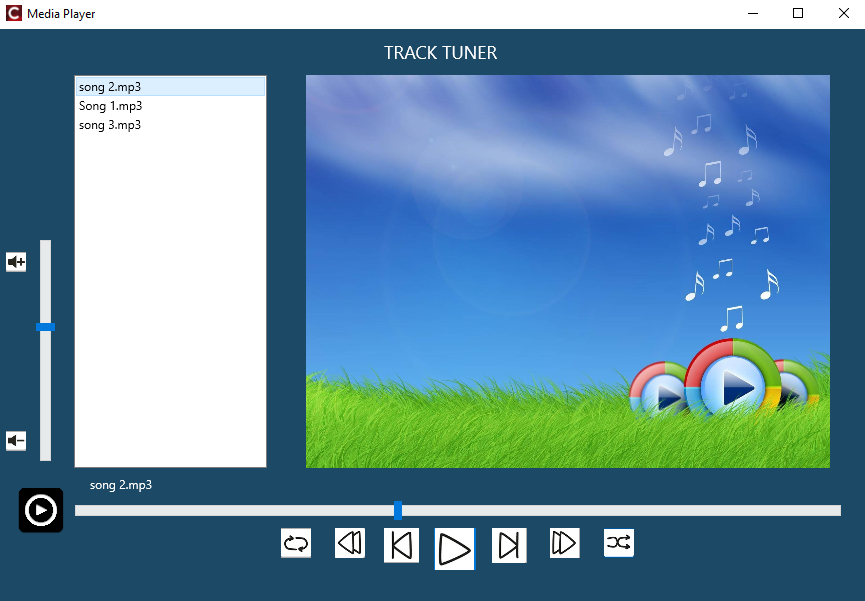

# 🎵 Track Tuner – Media Player
Track Tuner is a desktop media player built with C++ Builder. It supports multiple audio formats like MP3 and lets users load and play all songs from a chosen folder. Featuring essential controls including play, pause, skip, shuffle, loop, and volume control, it provides a simple and intuitive listening experience without heavy dependencies.

## 🧰 Requirements
✅ C++ Builder (Recommended: Embarcadero RAD Studio / C++ Builder Community Edition)
✅ Basic understanding of C++ (optional, for modifications)

## 🚀 Setup Guide
### 1. 💾 Install C++ Builder
1. Download from https://www.embarcadero.com/products/cbuilder
2. Install and set up the IDE (Community Edition is free)

### 2. 💾 Clone or Download This Repository

### 3. 🧭 Open the Project in C++ Builder
1. Launch C++ Builder
2. Go to File → Open Project
3. Open the ***.cbproj*** project file from the repo

### 4. ⚠️ Update Hardcoded Directory Paths
**The code uses hardcoded paths like:**
1. ***"D:\\MediaPlayer\\play.png"***
2. You must replace the ***"D:\\MediaPlayer"*** portion with the correct path to your local folder before running the app.

### 5. ▶️ 5. Build and Run
1. Press F9 or click Run in C++ Builder
2. After starting the app, a window will pop up asking you to select the folder containing your songs (e.g., *D:\songs*)
3. Choose your music folder and start enjoying your music!

